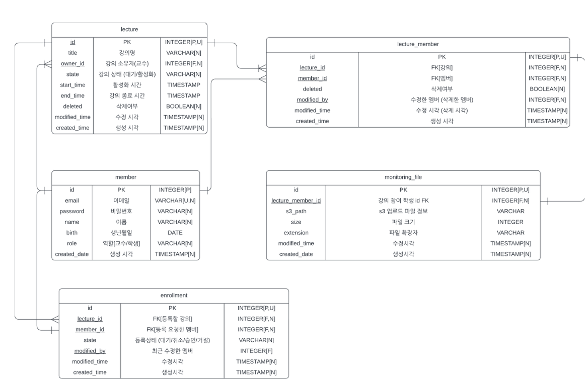

# DIDACTO-API

> **프로젝트 진행 기간**
> 
2024.03 - 2024.11

> **팀원 및 역할**
> 

| 역할 | 이름 | 담당 |
| --- | --- | --- |
| 팀장 | 소재휘 | Back-end, 전역 개발 환경 및 인프라 구축, P2P 및 원격제어 |
| 팀원 | 안윤호 | Back-end, 강의 관련 API, 다대일 모니터링 구현|
| 팀원 | 이원빈 | Back-end, 회원 관련 API, 인증, 결제 프로세스 및 IAMPORT 연동 |
| 팀원 | 김태영 | Front-end, 교수자용 Web Application |
| 팀원 | 이지민 | Front-end, 학생용 Desktop Application (Web to App) |
<Br>

> **Repository**
> 
[Organization](https://github.com/orgs/DIDACTO-SMU)   
[Core API Server](https://github.com/DIDACTO-SMU/didacto-api)   
[Event Server](https://github.com/DIDACTO-SMU/didacto-event-service)  
<Br>

> **작업 컨벤션 및 Docs**
> 

[기본 코드 작성 컨벤션](https://github.com/DIDACTO-SMU/didacto-api/pull/7)   
[작업 컨벤션 (Git)](https://github.com/DIDACTO-SMU/didacto-api/wiki/%08Work-Convention)   
[계층별 모듈의 주요 책임 및 고려할 점](https://sjh9708.tistory.com/239)  
[테스트 코드 작성 전략](https://sjh9708.tistory.com/240)     
[Web RTC 연동하기](https://sjh9708.tistory.com/171)   
<Br><Br>

> **주제 및 문제 정의**
> 

4차 산업 시대를 맞아, 초등 교육기관부터 고등 교육기관까지 아울러 컴퓨터를 활용한 실습 수업이 점점 확대되는 추세이다. 그러나 여기서 발생할 수 있는 문제점들이 몇몇 있다.

- **교강사의 시간 관리 및 수업 효율성**: 교강사는 질문이 들어오면 자리로 가서 하나하나 봐주는 모습은 흔히 볼 수 있다. 해당 과정이 축적되면 시간소모, 진도도 제대로 못나가고 양질의 교육을 받을 수 없다.
- **학생들의 학습 환경 및 행동 관리**: 부정행위나 수업 시간 중 컴퓨터를 사용하여 수업 외적인 행위를 하는 등 학생들의 통제의 어려움
- **실습환경의 운영 및 관리**: 교육기관은 양질의 교육을 위해 실습환경을 제공할 책임이 있으나, 실습환경의 운영 및 관리가 미흡한 경우가 있음.

**진짜 문제 정의**

점점 확대되는 컴퓨터 실습 기반의 교육 환경에서 학생들의 양질의 교육을 보장할 수 있도록 실습 인프라를 개선할 수 있는 SW 솔루션을 개발하자.
<Br><Br>

> **주제 구체화**
> 

**모니터링**

교수자가 학생 참여자들의 스크린을 실시간으로 1:N 으로 모니터링 할 수 있는 서비스

- 학생 사용자가 응용 프로그램 초기 실행시 학생 사용자의 카메라, 음성, 모니터 화면의 접근 여부 권한 허용 상태가 된다.
- 그 후 교수자가 생성한 강의실에 들어가면 교수자는 학생 사용자의 모니터를 볼 수 있다.  (교수 1 : 학생 N)

<Br>

**화면 공유**

교수자가 학생 참여자중 한 명을 선택시(모니터링 특정 학생 화면클릭) 지목한 학생 사용자와 1대1로 P2P가 이루어지는 서비스

- 서로 교환하는 미디어는 [교수자 : 음성, 카메라(얼굴)], [학생 : 컴퓨터 스크린]
- 교수자가 생성한 방에 들어와있는 학생 참여자중 교수자가 선택한 해당 학생 사용자와 교수자가 1대 1로 음성 및 화면을 공유할 수 있다.
- 이때 학생은 교수자의 캠 화면과 음성을 들을 수 있으며, 교수자는 학생의 모니터 화면 및 음성을 들을 수 있다.

<Br>

**원격 데스크톱**

교수자가 학생 사용자의 컴퓨터에 접근하여 직접 코드 수정 및 일정 액션을 취할 수 있는 서비스

- 교수자가 학생 사용자의 컴퓨터에 접근하여 특정 액션을 취할 수 있다.(마우스 클릭, 키보드 클릭)

<Br>

**수익성 모델**

SaaS의 수익성 모델로의 확장을 위한 결제 모듈 연동
   

<br><Br>
----
> **결과물**
> 

### 학생용 Desktop Application


### 교수자용 Web Application


### 모니터링


### P2P 및 원격제어


<br><Br>
----
> **상세**
> 

### A.  ERD 및 유저 플로우 (User Flow)



데이터 구조를 정의하기 위한 ERD 다이어그램이다. 최소 수준 MVP를 위한 최소 테이블을 정의하였다.


사용자가 애플리케이션 또는 웹사이트를 이용하는 과정을 시각적 표현한 플로우이다. 해당 리소스의 주요 정의사항은 아래와 같다.

1. **인증 페이지** : 사용자를 식별하기 위한 사용자 등록 및 사용자 인증과 관련된 기능. 사용자의 권한은 교수자와 학생으로 나뉜다.
2. **메인 페이지** : 사용자들은 자신이 소속된 강의들의 리스트를 체크할 수 있다. 교수자는 강의를 생성할 수 있고 학생은 참여요청을 강의에 소속될 수 있도록 한다. 
3. **강의 상세** : 교수자들은 아래의 주요 기능들을 수행할 수 있다.
    1. **모니터링** : 학생들의 화면을 그리드 형태로 모니터링한다. 이는 학생의 응용 프로그램 접속 + 교수자의 강의 활성화를 전제로 한다.
    2. **P2P 스트리밍** : 모니터링 중인 학생의 그리드를 클릭 시 P2P 통신을 시작한다. 서로 교환되는 미디어는 다음과 같다 →학생 : 자신의 스크린, 교수자 : 음성과 캠코더
    3. **원격 제어** : P2P 스트리밍 중 교수자가 학생의 스크린을 원격 제어할 수 있다.

<br><Br>

----

### B. 시스템 아키텍쳐


1. **학생용 응용 프로그램** : 각 학생들은 실습 컴퓨터에 클라이언트 프로그램을 설치하여 실행할 경우 상호작용이 가능해진다. 해당 응용 프로그램은 Electron을 사용하여 빌드한다.
    1. Electron은 웹 표준 기술(HTML/Javascript)를 기반으로 멀티 플랫폼 환경의 응용 프로그램으로 빌드가 가능하게 하는 기술이다. 따라서 개발 생산성과 상이한 OS 환경에서의 지원을 목표로 하여 채택하였다.
2. **Front-end Server**  : 사용자들의 회원 기능, 강의실 생성 및 참여 등 기본적인 기능을 수행하고, 교수자의 학생 모니터링 및 P2P, 원격 데스크탑을 수행할 수 있도록 UI를 제공한다. 
3. **API Server** : 필요한 API를 제공하는 서버를 구성한다. 더 나아가서 서비스를 분리하여 서버를 구성할 수 있는지에 대한 검토를 수행중이다.
    1. **Core-API** : 인증, 사용자 식별, 강의실 생성 및 참여 등 기본적인 기능 수행
    2. **Monitoring-API** : 응용 프로그램으로부터 주기적으로 스크린 화면 및 접속시간을 Push받고, 웹 페이지에게 지속적으로 해당 모니터링 리스트를 Polling하도록 비동기 동작에 특화된 API를 구축한다.
4. **Event Server** : P2P 통신을 시작할 때 필요한 시그널링 서버(Signaling Server)의 역할을 하면서 원격 데스크톱을 구현하기 위한 이벤트 중심 프로그래밍을 하기 위한 서버이다.

<br><Br>
----

## C. 모니터링
    

    
1. 학생들의 응용 프로그램에서는 지속적으로 사용자의 스크린 이미지와 Timestamp를 서버로 Push한다. 각각의 응용 프로그램은 독립적인 간격에 따라서 Push한다.
2. 교수자의 웹(모니터링 화면)에서는 일정 간격마다 해당 모니터링 정보의 리스트를 Polling하여 주기적으로 학생들의 스크린과 접속 여부(Timestamp)를 체크한다.


<br><Br>
---

## D. 실시간 미디어 스트리밍 및 원격 제어


### D-1. 요구사항

- 교수자와 학생이 각자의 캠코더 화면(교수자)과 컴퓨터 스크린 화면(학생)을 1:1 실시간으로 공유할 수 있도록 한다.
- 공유된 화면을 기반으로 교수자가 학생의 컴퓨터를 원격으로 제어할 수 있도록 한다.

### D-2. Web RTC


교수자가 학생과 1:1로 미디어를 실시간으로 교환하기 위해서 **Web RTC** 기술을 채택하였다.

- WebRTC(Web Real-Time Communication)는 웹 브라우저 간에 실시간으로 음성, 영상 및 데이터 통신을 가능하게 하는 오픈 소스.
- **Google Meet, Zoom, Facebook Messenger 등 실시간 미디어 스트리밍이 사용되는 어플리케이션**에서 많이 사용
- 초기 연결에 성공한 이후에는 P2P Connection을 통해 데이터를 주고받는다는 특징

**Web RTC의 주요 구성 요소와 구현 계획**


- STUN 서버 : **클라이언트들이 서로에게 직접 연결이 가능하도록 외부에서 접근 가능한 주소와 방법을 알려주는 역할.** 클라이언트는 STUN 서버에게 자신의 Public IP 주소 및 포트를 요청하고, 이 정보를 상대 Peer와 공유한다.
    - **STUN 서버로는 Google에서 제공하는 STUN 서버를 사용**
- **시그널링 서버 :** **통신 시작을 위한 연결 정보를 교환하는 중계 서버의 역할.** 클라이언트들이 서로의 주소를 알아내고 통신을 시작하기 위해서는 시그널링 서버가 필요하다. 클라이언트들 간의 연결 메타데이터 및 통신을 위한 제어 메시지를 전달해준다.
    - **시그널링 서버가 필요하므로 문서 상단에서 설명했던 Event Server를 구축하여 서로의 Connection 정보를 교환하도록 중개할 수 있도록 시스템을 구축한다.**
- **Connection 과정** : **Offer/Answer(SDP 교환)** → **ICE Candidate** 과정을 거쳐 서로의 미디어 스트림 Connection 정보를 교환한다.

**Web RTC를 채택한 이유**

1. **P2P Connection** : WebRTC는 P2P 연결을 통해 데이터를 전송하며 초기 연결 과정을 제외하고는 서버를 경유하지 않으므로 Latency가 매우 낮고 서버의 의존도를 줄일 수 있다.
2. **Bandwidth 자동 조절**: 네트워크 상태를 실시간으로 모니터링하고 이에 맞추어 처리 속도를 조정할 수 있는 기능을 가지고 있기 때문에 네트워크 사용을 최적화할 수 있다.
3. **미디어 퍼포먼스** : 저비용으로 시스템을 구축할 때 비교적 영상의 초당 프레임 수가 높고, 자체적인 코덱에 의해 선명한 화질을 유지하며 영상을 스트리밍 할 수 있다.
4. **보안**: 스트림을 암호화하기 때문에 전송되는 데이터의 기밀성을 유지할 수 있다. 따라서 민감한 정보를 교환하는 화면 공유 과정의 보안성을 지킬 수 있다.

<br><Br>
---

### D-3. 소켓 네임스페이스 별 세션 제어와 커스텀 락

P2P 연결을 할 때, Websocket을 사용하여 시그널링 역할을 한다. 
우리의 요구사항에서 접속은 반드시 교수자와 학생이 1:1로 매칭되어야 하며 접속 순서에 대한 규칙이 있었다. 


**Connection 규칙 : 이상적인 P2P는 A 접속자끼리 1:1 통신, B 접속자끼리 1:1 통신을 하여야 한다**.

- 교수자는 학생이 접속하지 않은 Room에는 접근 불가능 (학생의 화면이 없으므로 감시할 필요도 없다.)
- 교수자는 학생의 연결이 끊어지면 함께 연결이 끊어져야 한다.
- 학생이 Room에 접속 도중, 동일한 학생의 다른 세션이 같은 Room에 접속할 때 기존 접속중이던 세션은 강제 접속 종료가 되어야 한다.
- 교수자도 마찬가지로 브라우저에서 Room에 접속 도중, 또다른 브라우저에서 같은 Room에 접속할 때 기존 접속중이던 브라우저는 강제로 접속 종료되어야 한다.


요구사항에 대한 접속 규칙을 위해서 소켓 네임스페이스 별 세션을 제어하기 위한 Locking의 구현이 필요했다. RDBMS Locking, Zookeeper 등 다양한 Locking을 구현하기 위한 도구들이 있었으며 그 중 Redis를 채택하여 커스텀 락을 구현하였다. 

**Redis를 채택한 이유**

- Redis의 In-Memory의 특성 상 높은 퍼포먼스를 발휘한다.
- 휘발성 데이터인 Connection의 정보를 관리하기 적합하다.
- 분산 락을 지원하기 때문에 분산 환경에서의 동기화 등의 이슈를 처리하기 유리하다.

**커스텀 락의 프로세스**

1. **락 획득** : 학생이나 교수자가 Room에 접속하려고 할 때, 먼저 Redis에서 해당 Room에 대한 락을 획득한다. 만약 이미 락이 존재하면 다른 사용자가 접속 중임을 의미하므로, 새로운 접속 시도를 거부하거나 기존 접속을 종료한다.
2. **락 해제** : 학생이나 교수자가 Room에서 나가면 Redis에서 락을 해제하여 다른 사용자가 Room에 접속할 수 있도록 한다.
3. **자동 해제** : 만약 클라이언트가 비정상적으로 종료되거나 연결이 끊어졌을 경우를 대비하여 Disconnection에 대한 이벤트 처리 및 락에 TTL을 설정하여 자동으로 해제되도록 설정한다.

<br><Br>
---

### D-4. 원격 제어 프로세스


1. Event Sever에는 P2P 연결에 사용한 고유한 식별자(강의 - 학생)으로 구분되는 Room이 존재하며, 해당 그룹 내에 있는 클라이언트끼리의 이벤트 Subscribe와 Publish가 이루어진다.
2. P2P 스트리밍이 진행 중일 때 **Event-Driven 방식으로 원격 제어**가 이루어진다.

<br>

**원격 제어 프로세스**

**원격 데스크탑의 작동 방식은 위의 차트와 같이 다음 과정을 따른다.**

1. 교수자의 이벤트 발생(마우스 Up/Down, 키보드 Up/Down 등) 시 Event 서버로 Publish한다.
2. 해당 이벤트를 Listen하고 있던 학생이 Message를 Subscribe한다.
3. 학생의 응용 프로그램은 해당 메시지를 바탕으로 O에 I/O 이벤트를 발생시킨다

<br><Br>
---

## E. 결제 프로세스


    
### **결제 요구 사항**

- 사용자가 DIDACTO 프리미엄 이용권을 인터넷 결제로하여금 구독 할 수 있게한다.
- 결제 과정중 오류 발생시 사용자에게 결제를 요청하지 않거나 취소되게끔 할 수 있게한다.

### **IAMPORT**

```
국내 PG결제 연동을 쉽게해주는 결제 API입니다. 
PG란 Payment gateway의 약자인데, 신용카드사와 직접 계약하기 어려운 온라인 쇼핑몰을 대신해 결제와 정산 업무를 대행해 주는 업체입니다.
신용카드, 실시간 계좌이체, 가상계좌, 간편결제 서비스(예: 카카오페이, 페이코) 등에 쓰이며 보안을 중시합니다.
```


### **PortOne 결제 전체 흐름**

---


포트원의 동작 과정은 결제 → 완료 → 결제 정보를 서버로 전송 → 서버에서 검증처리후 결제 완료 의 순서대로 진행이 된다.

### **IMP 결제 프로세스(프론트와 백관점)**

회원이 DIDACTO 프리미엄 서비스를 구독하기 위해 결제 행위를 행할시 다음 과정을 따른다.

1. 등록되어있는 실제 아임포트 ID를 통하여 IMP 라이브러리를 통해 초기화
2. 서버에 주문 생성 후 받아온 주문ID를 통하여 IMP 라이브러리를 통해 결제 방식과 결제 금액, 주문 정보를 담은 객체로 결제 요청을 보냄
3. IMP 결제 성공시 결제 고유 번호와 주문번호 서버에 전달
4. 서버 오류로 인해 주문ID 미생성 or 결제 금액을 클라이언트 측에서 의도적으로 조작시 결제 취소 및 결제가 불가능하도록 로직 설계

### **PortOne API를 이용한 결제 예외처리**

결제 검증부분

```java
iamportClient.cancelPaymentByImpUid(new CancelData(iamportResponse.getResponse().getImpUid(), true, new BigDecimal(iamportPrice)));
            throw new RuntimeException("결제금액 위변조 의심");
```

PortOne쪽의 API를 이용하면 결제 취소를 구현할 수 있다.

사용자가 설정해놓은 가격을 임의로 조작하여 결제를 하려고 할 때 실제 결제가 완료되었어도 서버측에서 결제취소를 해줄 수 있는 기능을 제공한다.


### **Webhook도입**

웹훅이란 특정 이벤트가 발생하였을 때(결제가 완료되었을 때) 설정해놓은 URL로 데이터를 보내주는 기능이다.

만약 결제가 성공했다면 해당 데이터를 설정해놓은 URL로 보낼 수 있게 된다.

`curl -H "Content-Type: application/json" -X POST -d '{ "imp_uid": "imp_1234567890", "merchant_uid": "order_id_8237352", "status": "paid" }' { NotificationURL }`

- imp_uid :  결제번호
- merchant_uid : 주문 번호
- status : 결제상태

**웹훅을 도입하는 이유**

- 보통 웹훅은 **가상계좌에 돈이 입금되었는지 안되었는지 확인하는 용도**로 많이사용한다고 한다. 가상계좌는 즉시 돈이 입금되지 않기때문에 포트원쪽에서 대기를 하고 있다가 만약 사용자가 돈을 입금했다! 라는 이벤트가 발생하면 그 때 백엔드단에서 처리를 해줄 수 있다.
- 우리는 가상계좌에 돈을 입금하는 경우는 일단 고려하지 않고 있으니 배제하고 **인터넷 연결 끊김, 브라우저 자동 새로고침 등의 이유**로 클라이언트에서 결제 완료에 대한 응답을 받지 못하는 경우가 간헐적으로 발생하는 경우에 대비해 웹훅을 사용하도록 한다.

